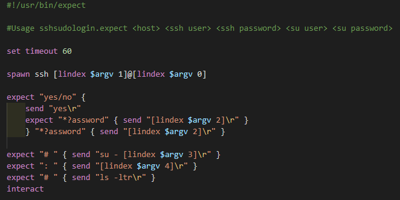
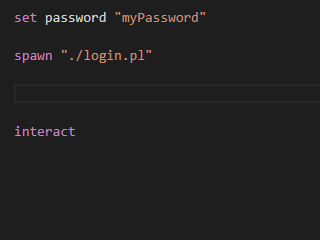

# Expect for Visual Studio Code

## Features

### Provides Colorization for Expect scripts. 

 

### Provides basic snippets for commonly used boilerplate code 

 

## Expect scripts

- Expect scripts are files that end in ".exp" or ".expect"
- Expect is an extension of Tcl and  is a tool for automating interactive applications 
- [expect creator's website](https://core.tcl-lang.org/expect/index)